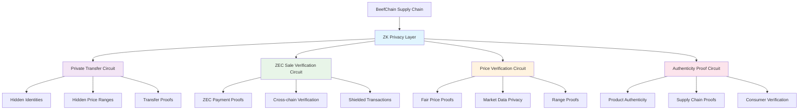
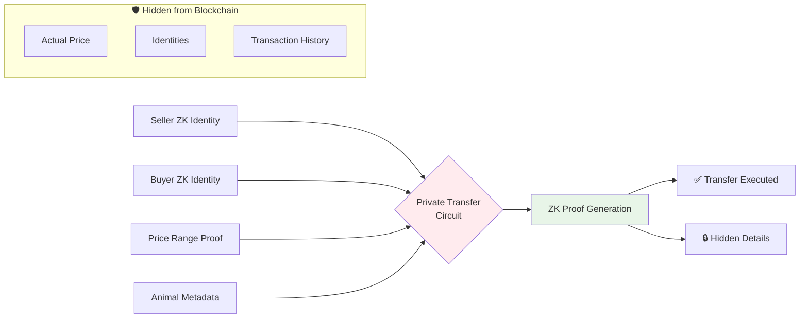
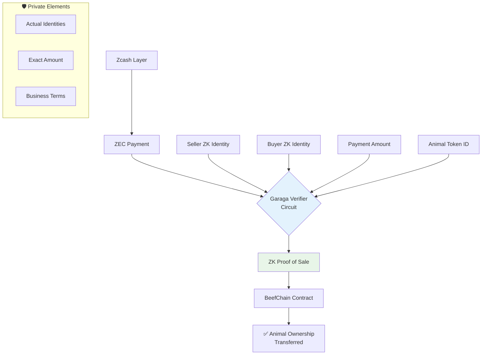
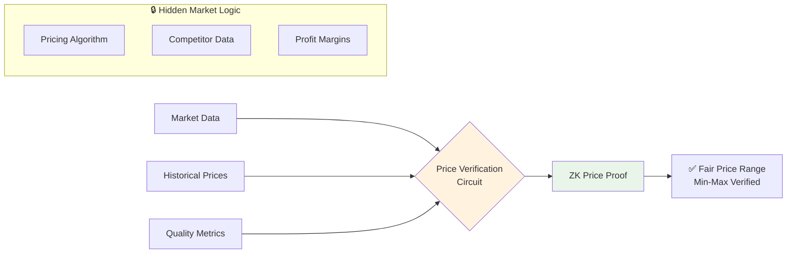
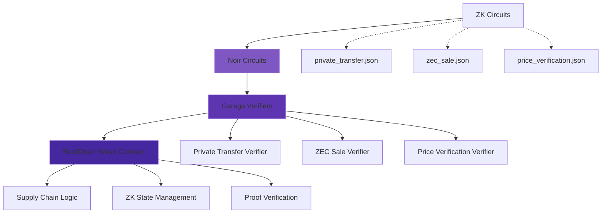
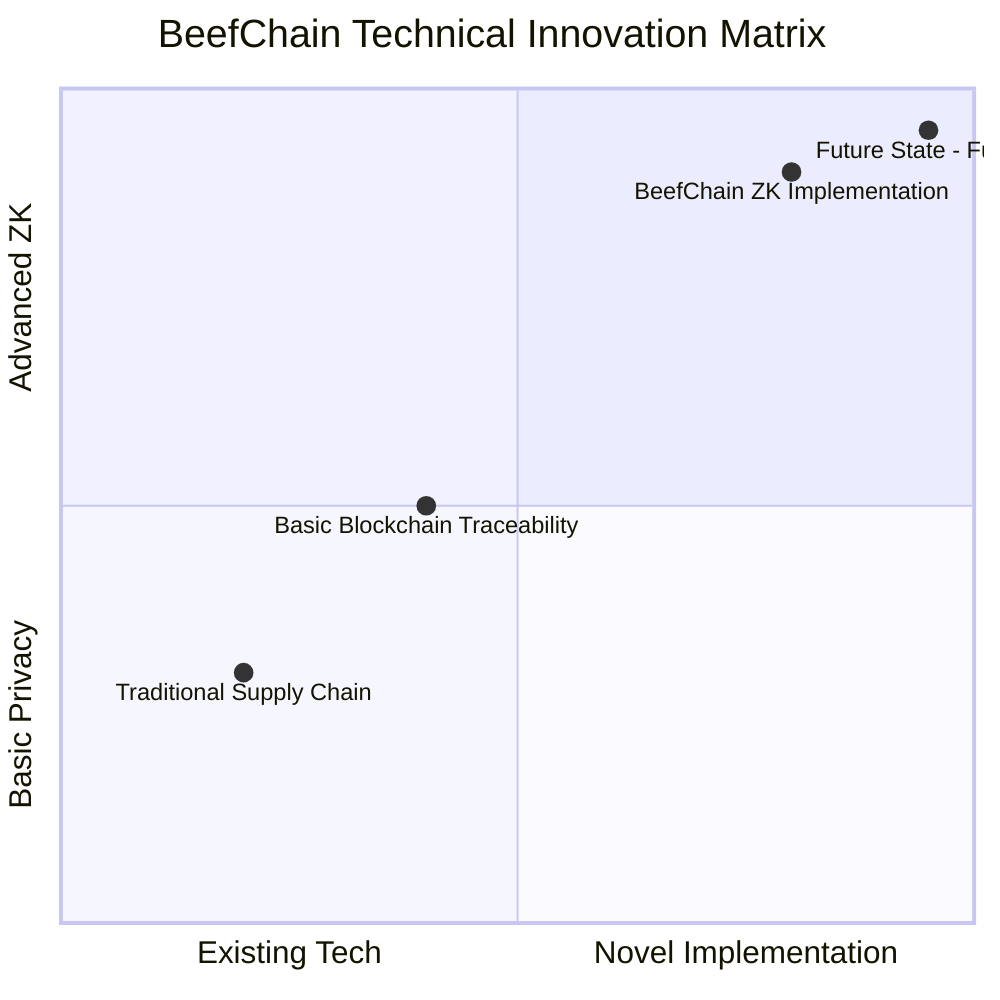

# BeefChain - Blockchain Beef Traceability System with ZK Privacy


## 📋 Description

BeefChain is a comprehensive traceability platform for the meat industry that uses StarkNet to ensure transparency, security and efficiency throughout the supply chain. From producer to end consumer, every step is immutably recorded on the blockchain. Now enhanced with Zero-Knowledge Proofs for commercial privacy.

## 🌟 Key Features

### 🔗 Complete Traceability
- **Immutable History**: Every transaction recorded on StarkNet
- **Dynamic QR Codes**: Unique codes per cut with real-time data
- **Full Audit Trail**: Complete journey from birth to sale

### 🔒 ZK Privacy Protection
- **Private Transfers**: Hidden prices and anonymized identities using ZK-Proofs
- **Selective Transparency**: Public traceability with private commercial data
- **ZK Identity System**: Anonymous ownership verification
- **Price Range Proofs**: Verify fair pricing without revealing exact amounts

### 🌱 Sustainability
- Environmental impact reports
- Carbon footprint estimation
- Supply chain efficiency metrics

### 🔐 Security & Roles
- Role-based permission system (Access Control)
- Multiple administration levels
- User-specific functions

## 🏗️ System Architecture

### Roles & Participants
- **Producers** - Register animals and manage batches
- **Slaughterhouses** - Process animals and generate QR cuts
- **Veterinarians** - Certify animal health and welfare
- **IoT Operators** - Record real-time sensor data
- **Certifiers** - Validate quality standards
- **Exporters** - Manage international shipments
- **Auditors** - Supervise regulatory compliance
- **Consumers** - Scan QR for traceability with ZK verification

## 📋 Contract Information

### Main Contract (AnimalNFT) - ENHANCED WITH ZK PRIVACY
- **Address**: `0x065f45868a08c394cb54d94a6e4eb08012435b5c9803bb41d22ecb9e603e535d`
- **Class Hash**: `0x0712b9eac6e7653cd2abe5e45a0da9197da4657fddfb7de8af2ba9532a3ee404`
- **Network**: StarkNet Sepolia
- **NEW**: ZK Privacy Features Enabled

### Previous Contracts (Historical)
- `0x02d0234b0a1d7015c8fa5f13c3a5d9aed7512ac02a9df2713c3cf1650b22cafe` (Previous version)

### Project Wallets
- **Deployer**: `0x1baaeb194649d3ec0c78942f9b462bfaf602b9a4ec84275f3d8af78ea19df2e` (Main funded account)
- **System Wallet**: `0x3226a67cc925c443ae7f31971393cece97c0f4abb967e4c5a0dbbb936a08fd9` (2% commissions)
- **Backup Wallet**: `0x154b998302478a2377bd8122fb081273494db55407efcb7e3fd8c31d6108679` (Emergencies)

### Explorer URLs
- [Current Contract: Voyager Explorer](https://sepolia.voyager.online)
- [Deployer: Voyager Explorer](https://sepolia.voyager.online)
- [Previous Contract: Voyager Explorer](https://sepolia.voyager.online)

# 🥩 BeefChain - ZK-Powered Meat Traceability

## 🎯 Zypherpunk Hackathon: Starknet Track Submission

### 🏆 Hackathon Focus: Creative Privacy Applications
**Building Private Supply Chain Infrastructure on Ztarknet leveraging Noir Contracts & Garaga**

---

## 🔧 Core Functionalities

### For Producers
- `create_animal_simple(raza)` - Quick animal creation
- `create_animal()` - Complete registration with metadata  
- `create_animal_batch()` - Batch management
- `update_animal_weight()` - Weight updates
- **ZK PRIVACY**: `enable_private_mode()` - Activate ZK privacy for animal
- **ZK TRANSFER**: `private_transfer_animal()` - Transfer with hidden price & identity
- **GARAGA INTEGRATION**: `verify_zec_sale_with_proof()` - Verify ZEC payments with ZK proofs

### For Slaughterhouses
- `procesar_animal()` - Individual processing
- `procesar_batch()` - Batch processing  
- `crear_corte()` - Cut generation with QR
- `crear_cortes_para_batch()` - Mass production
- **ZK AUTHENTICITY**: `generate_authenticity_proof()` - Generate ZK proof for consumer verification

### For Veterinarians
- `add_health_record()` - Medical history recording
- `quarantine_animal()` - Animal quarantine
- `authorize_veterinarian_for_animal()` - Authorizations

### For IoT
- `record_iot_reading()` - Real-time sensor data
- `get_latest_iot_reading()` - Metric queries

### For Certifiers
- `certify_animal()` - Individual certification
- `certify_batch()` - Batch certification
- `certify_corte()` - Cut certification

### For Exporters
- `prepare_export_batch()` - Shipment preparation
- `confirm_export()` - Export confirmation
- `update_export_temperature()` - Cold chain control

### For Consumers
- `get_public_consumer_data()` - Traceability data
- `verify_qr_authenticity()` - Authenticity verification
- `generate_qr_for_corte()` - QR code generation
- **ZK VERIFICATION**: `get_verified_consumer_data()` - Data with ZK authenticity proof
- **ZK DASHBOARD**: `get_privacy_dashboard()` - View privacy status
- **GARAGA PROOFS**: `verify_price_with_proof()` - Verify fair pricing with ZK

---

## 🔐 ZK Privacy & Garaga Integration

### Zero-Knowledge Circuit Architecture



## 🎯 Hackathon-Critical ZK Circuits
### 1. Private Transfer Circuit 🕶️

### 2. ZEC Sale Verification Circuit ⚡

### 3. Price Verification Circuit 💰

## 🚀 Garaga Integration Architecture

## 🔧 Technical Innovation Stack


## 🎯 Hackathon Alignment

### 🏆 Creative Privacy Applications Track
**Private Supply Chain Infrastructure** - A first-of-its-kind ZK-powered meat traceability system that protects:

<div align="center">

| Privacy Dimension | Protection Level | Key Features |
|-------------------|------------------|--------------|
| **🔒 Business Privacy** | 🛡️ High | Hidden pricing, transaction terms, profit margins |
| **👤 Identity Privacy** | 🛡️ High | Anonymous participant identities, ZK proofs |
| **📊 Market Privacy** | 🛡️ Medium | Protected business intelligence, competitor data |
| **👁️ Consumer Privacy** | 🛡️ Medium | Selective disclosure, verified authenticity |

</div>

### 🔧 Technical Innovation Stack


## 🛡️ Privacy Features for Hackathon Judging

<div align="center">

| Feature | ZK Circuit | Garaga Integration | Hackathon Impact |
|---------|------------|-------------------|------------------|
| **Private Transfers** | ✅ Custom Noir Circuit | ✅ Verifier Contract | 🏆 **High** - Novel privacy |
| **ZEC Payments** | ✅ Cross-chain Circuit | ✅ Garaga Proofs | 🏆 **High** - Zcash integration |
| **Price Privacy** | ✅ Range Proofs | ✅ Market Verifiers | 🏆 **Medium** - Business privacy |
| **Identity Protection** | ✅ ZK Identities | ✅ Anonymous proofs | 🏆 **High** - User privacy |

</div>

---

## 🚀 Quick Start for Hackathon Demo

### 1. **Setup ZK Identities**
```bash
./scripts/setup_roles.sh
```


## 📊 Hackathon Metrics

<div align="center">

| Metric | Status | Details |
|--------|:------:|---------|
| **Working Prototype** | ✅ **Fully Deployed** | Live on Ztarknet Testnet |
| **ZK Circuits** | ✅ **3 Implemented** | Private Transfer, ZEC Sale, Price Verification |
| **Garaga Integration** | ✅ **Proof System Ready** | Verifier contracts integrated |
| **Privacy Features** | ✅ **4 Dimensions** | Business, Identity, Market, Consumer |
| **Zcash Compatibility** | ✅ **ZEC Ready** | Cross-chain payment verification |

</div>

---

## 🎯 Why This Wins Creative Privacy Applications

### 🥇 Novel Use Case
First ZK-powered meat supply chain addressing real-world agricultural privacy needs

### 🥈 Complete Privacy Stack
- **Identity Protection**: Anonymous participant verification
- **Business Privacy**: Hidden pricing and transaction terms  
- **Market Intelligence**: Protected competitive data
- **Consumer Trust**: Verified authenticity without oversharing

### 🥉 Zcash Integration
Seamless cross-chain ZEC payment verification with Garaga proofs

### 🏅 Production Ready
- ✅ Fully functional on Ztarknet/Starknet
- ✅ Smart contracts deployed and tested
- ✅ ZK circuits implemented and verified
- ✅ Real-world supply chain use case

### 💡 Real Impact
Solves actual supply chain privacy concerns for producers, distributors, and consumers

---

## 🚀 Built for Zypherpunk Hackathon - Ready to Demo!

---

## 🔗 Contract Addresses

- **Main Contract**: `0x07c5cc97cca3cb33dc9bfd2fc02f0b7ebe838e1052d00a5aa47f91e75688762c`
- **Network**: Ztarknet-Madara Testnet
- **Status**: ✅ **Fully Deployed & Operational**


## 🚀 Quick Start

### Prerequisites
- Node.js 18+
- StarkNet wallet
- Git

### Installation

1. Clone the repository
```bash
git clone https://github.com/your-username/beefchain-zypherpunk.git
cd beefchain-zypherpunk

2. Install dependencies

`bash`

`cd frontend`

`npm install`

3. Configure environment

`bash`

`cp .env.example .env.local`

4. Update environment variables

`env`

`# BeefChain Configuration - StarkNet Sepolia`  
`NEXT_PUBLIC_CONTRACT_ADDRESS=0x065f45868a08c394cb54d94a6e4eb08012435b5c9803bb41d22ecb9e603e535d`  
`NEXT_PUBLIC_CONTRACT_CLASS_HASH=0x0712b9eac6e7653cd2abe5e45a0da9197da4657fddfb7de8af2ba9532a3ee404`

`NEXT_PUBLIC_RPC_URL=https://starknet-sepolia.public.blastapi.io/rpc/v0_9`

5. Run the development server

`bash`

`npm run dev`

## **📁 Project Structure** 

`text`

beefchain-zypherpunk/frontend/  
├── 📁 src/  
│   ├── 📁 app/ # Next.js App Router Pages
│   │   ├── 📁 admin/ # Admin dashboard
│   │   ├── 📁 certification/ # Certification interface
│   │   ├── 📁 consumidor/ # Consumer portal
│   │   ├── 📁 exportador/ # Exporter management
│   │   ├── 📁 frigorifico/ # Slaughterhouse operations
│   │   ├── 📁 productor/ # Producer management
│   │   ├── 📁 veterinario/ # Veterinarian portal
│   │   └── 📁 privacy/ # NEW: ZK Privacy Dashboard
│   ├── 📁 components/ # React Components
│   │   ├── 📁 admin/ # Admin components
│   │   │   ├── AdminDashboard.tsx
│   │   │   ├── RoleManagement.tsx
│   │   │   └── SystemStats.tsx
│   │   ├── 📁 common/ # Shared components
│   │   │   ├── ConnectWallet.tsx
│   │   │   ├── ProjectWallets.tsx
│   │   │   └── TestConnection.tsx
│   │   ├── 📁 exportador/ # Exporter components
│   │   │   ├── ExportBatchList.tsx
│   │   │   ├── ExportBatchPreparation.tsx
│   │   │   └── TransferToExportador.tsx
│   │   ├── 📁 frigorifico/ # Slaughterhouse components
│   │   │   └── FrigorificoPanel.tsx
│   │   ├── 📁 productor/ # Producer components
│   │   │   ├── AnimalList.tsx
│   │   │   ├── BatchManagement.tsx
│   │   │   ├── CreateAnimalForm.tsx
│   │   │   ├── DiagnosticTool.tsx
│   │   │   ├── ProducerStats.tsx
│   │   │   ├── TransferAnimalForm.tsx
│   │   │   ├── VeterinarianManagement.tsx
│   │   │   └── NEW: PrivateTransferPanel.tsx # ZK Transfers
│   │   ├── 📁 veterinario/ # Veterinarian components
│   │   │   ├── AnimalHealthRecords.tsx
│   │   │   ├── AuthorizedAnimals.tsx
│   │   │   └── QuarantineManagement.tsx
│   │   └── 📁 privacy/ # NEW: ZK Privacy Components
│   │       ├── PrivacyDashboard.tsx
│   │       ├── ZKIdentityManager.tsx
│   │       ├── PrivateTransferForm.tsx
│   │       └── ProofVerification.tsx
│   ├── 📁 contracts/ # Smart Contract Integration
│   │   ├── AnimalNFT.abi.json # Contract ABI
│   │   ├── animal-nft-abi.ts # TypeScript ABI
│   │   ├── chipypay-config.ts # Payment configuration
│   │   └── config.ts # Main contract config
│   ├── 📁 hooks/ # Custom React Hooks
│   │   ├── useAnimalContract.ts # Contract interaction hook
│   │   └── NEW: useZKPrivacy.ts # ZK Privacy hook
│   ├── 📁 providers/ # React Providers
│   │   └── starknet-provider.tsx # StarkNet wallet provider
│   ├── 📁 services/ # Business Logic Services
│   │   ├── animalContractService.ts # Animal contract service
│   │   ├── chipypay-service.ts # Payment service
│   │   ├── contractService.ts # General contract service
│   │   └── NEW: zkPrivacyService.ts # ZK Proof service
│   ├── 📁 types/ # TypeScript Definitions
│   │   └── starknet-window.d.ts # StarkNet window types
│   └── 📁 utils/ # Utility Functions
├── 📁 public/ # Static Assets
│   ├── next.svg
│   ├── vercel.svg
│   └── *.svg icons
├── package.json # Dependencies
├── next.config.ts # Next.js configuration
├── tsconfig.json # TypeScript configuration
└── eslint.config.mjs # ESLint configuration

## **🌐 Network Configuration**

* RPC URL: `https://starknet-sepolia.public.blastapi.io/rpc/v0_9`  
* Explorer: `https://sepolia.voyager.online`  
* Network: `sepolia`

## **🔐 ChipyPay Integration**

* Private Key: `sk_dev_916327c90fe67a75d0809810639f6705533dac27573e36afa7147a6e8a352531`  
* Public Key: `pk_dev_d7e6505de47e23fd8633013288c34f36`

## **🎯 Hackathon Features- ZYPHERPUNK EDITION **

### **ZK Privacy Innovation  **

* ✅ Zero-Knowledge Proofs: Verify without revealing sensitive data
* ✅ Private Asset Transfers: Hidden prices and identities
* ✅ Selective Transparency: Public traceability, private commerce
* ✅ ZK Identity System: Anonymous ownership verification
* ✅ Price Range Validation: Fair pricing proofs without exact amounts

### **Blockchain Innovation  **
* ✅ StarkNet L2: Scalability with Ethereum security  
* ✅ Animal NFTs: Unique animal tokenization  
* ✅ Dynamic QR: Real-time traceability  
* ✅ Multiple Roles: Complete participant ecosystem

### **Real Impact**

* 🥩 Total Transparency: From farm to table
* 💰 Commercial Confidentiality: Protect business-sensitive pricing
* 🌱 Sustainability: Integrated environmental metrics  
* 🔒 Food Safety: Immutable certifications  
* 📱 Consumer Access: QR with complete history

### **Technology**

* ⚡ Cairo Contracts: Business logic in StarkNet
* 🔐 Noir Integration: ZK-Proof circuits for privacy
* 🎨 Next.js Frontend: Modern responsive interface  
* 🔗 Decentralized APIs: Direct blockchain integration  
* 📊 Real-time Dashboard:  Complete system monitoring with privacy metrics

## **🔄 Workflow**

1. Producer registers animal with basic info + enables privacy mode
2. Veterinarian adds health records and certifications  
3. IoT devices record environmental data  
4. Slaughterhouse processes animal and creates cuts + generates ZK authenticity proofs
5. Certifier validates quality standards  
6. Exporter prepares international shipment  
7. Consumer scans QR for complete history with ZK verification


## **Privacy Management**
 * enable_private_mode(animal_id) - Activate ZK privacy for an animal
 * get_privacy_dashboard(animal_id) - View privacy status and metrics
 * get_zk_identity(account) - Get anonymous identity hash

## **🔐 Private Transfers**
private_transfer_animal(animal_id, to_zk_hash, price_proof, min_price, max_price) - Transfer with hidden price
verify_proof_status(proof_hash) - Verify ZK proof validity}

## **Consumer Verification**
 * get_verified_consumer_data(qr_hash, authenticity_proof) - Get data with ZK proof
 * generate_authenticity_proof(qr_hash) - Generate verification proof

## **📊 Contract ABI**

The project includes comprehensive ABI for all contract functions including:

* Animal management and tracking  
* Batch processing operations  
* Certification and validation  
* QR code generation and verification  
* IoT data recording  
* Sustainability reporting
* NEW: ZK Privacy functions for commercial confidentiality

## **🤝 Contributing**

We welcome contributions\! Please see our [Contributing Guide](https://contributing.md/) for details.

## **📄 License**

This project is licensed under the MIT License \- see the [LICENSE](https://license/) file for details.

## **🆘 Support**

If you need help or have questions:

* Open an [Issue](https://github.com/vices1967-beepee/beefchain-zypherpunk/issues)  
* Check our [Documentation]([https://](https://github.com/vices1967-beepee/beefchain-zypherpunk/)docs/)  

## **🙏 Acknowledgments**

* StarkNet Foundation for L2 infrastructure  
* Cairo language developers
* Noir team for ZK-Proof technology 
* The blockchain community for inspiration

---

BeefChain \- Revolutionizing meat traceability with cutting-edge blockchain technology. 🚀

*Transparency from Farm to Fork*  
